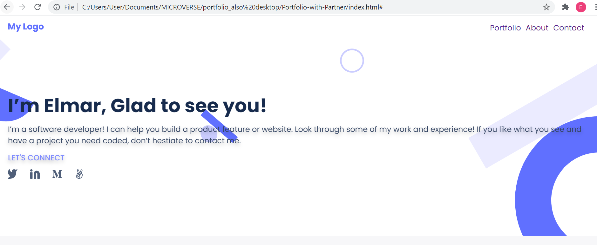

# Portfolio: Desktop version

> We build our portfolio desktop website

This is the first milestone in the process of creating our portfolio website.

## Built With

- HTML/CSS
- Figma

## Authors

👤 **Elmar Abdulkarimov**

- GitHub: [@elmar8287](https://github.com/elmar8287)

## Live demo
You can visit live version via [link](https://elmar8287.github.io/portfolio.github.io/)

## 🤝 Contributing

Contributions, issues, and feature requests are welcome!

Feel free to check the [issues page](../../issues/).

## Show your support

Give a ⭐️ if you like this project!
